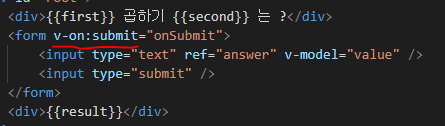
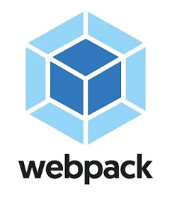
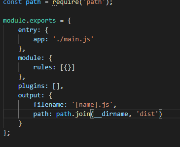
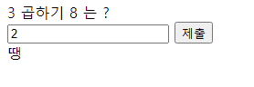
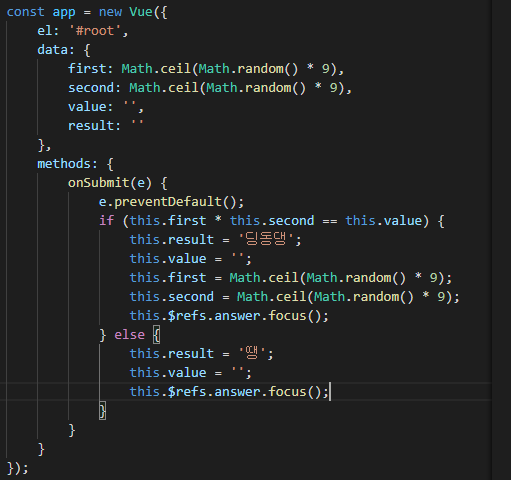
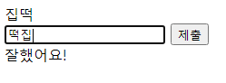
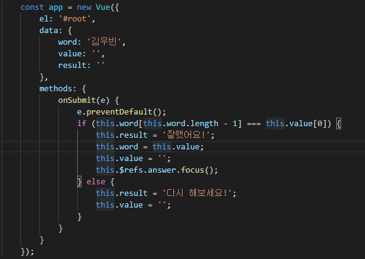
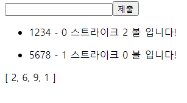
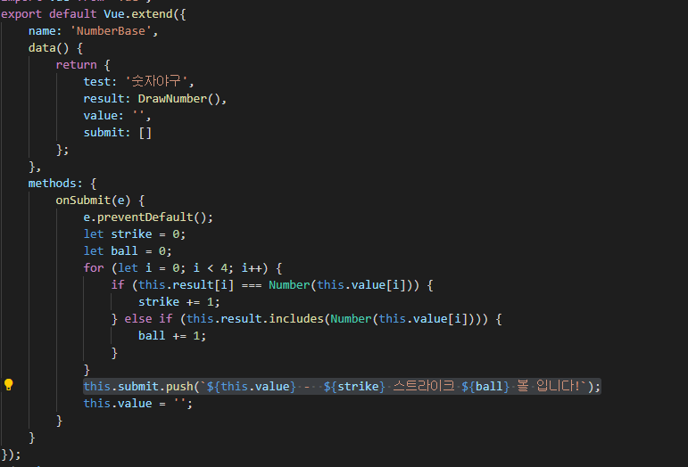

유튜브 <a href="https://www.youtube.com/channel/UCp-vBtwvBmDiGqjvLjChaJw">제로초 </a> 님 VueJS 강의를 참고하여 만듦


[웹팩](#WebPack)

[구구단](#구구단)

[끝말잇기](#끝말잇기)

[숫자야구](#숫자야구)

# What is View JS?


## 왜 VueJs 인가

1. 학습 곡선이 낮다.
2. 컴포넌트의 분해
3. 가볍고 빠르다.
4. View 최적화
5. 모듈의 다양성

## CDN

```javascript
<script src="https://cdn.jsdelivr.net/npm/vue/dist/vue.js"></script>
```

## NPM

```javascript
npm install vue
```

## CreateVueApp(Yarn)

```javascript
yarn global add @vue/cli @vue/cli-service-global

vue create (폴더명)

cd (폴더명)

yarn serve
// 실행
```

## 어떻게 사용해요?

```javascript

// Vue.JS 선언문
const app = new Vue({
    el:"#root",
    data: {
        // State
        value:'',
        isTrue:false
    },
    methods: {
        // function
        test() {
            this.value = 'test'
        }
    }
})

// HTML 내에서 변수사용

<div>{{value}}</div>

// if 조건문 사용

// 보이지 않음
<div v-if="isTrue"></div>
// 보임
<div v-else="isTrue"></div>

// state 변경
// text 변경시 state 자동변경
<input type="text" v-model="value" />

// ref

<input type="text" ref="test" />

...
// DOM 에 접근하고 싶은 경우
refTest() {
    this.$refs.test.focus()
}
```

## 컴포넌트 생성

```javascript
// 이때 CamelCase 보다는
// CababCase 로 작성해주는것이 좋다
// Example => component-name
//  X => ComponentName
Vue.component('컴포넌트명', {
    template:`
        <html 코드작성>
        </>
    `,
    data() {
        return {
            value:'test'
        }
    },
    methods: {

    }
})

// 이렇게 활용 가능하다

<컴포넌트명 />
```

## Props

```javascript
<html>
    /* Props정의 */
    <test-component test-prop="test" />
</html>
<script>
    Vue.component('컴포넌트명', {
        template,
        // CamelCase 로 받을 수 있음
        props:['testProp'],
        data() {
            return {
                test: this.testProp
            }
        },
        methods,
    })
</script>
```



해당 사진과 같이 submit 이벤트는 v-on:(이벤트명) 으로 작동한다.

# WebPack



## 웹팩은 다양한 모듈들을 하나의 script 로 합쳐주는 작업을 한다.



webpack.config.js 파일을 만들어 해당 내용을 입력해 준다.

# 구구단



## 구구단 Vue 코드



# 끝말잇기



## 끝말잇기 Vue 코드



# 숫자야구



## 숫자야구 Vue 코드


